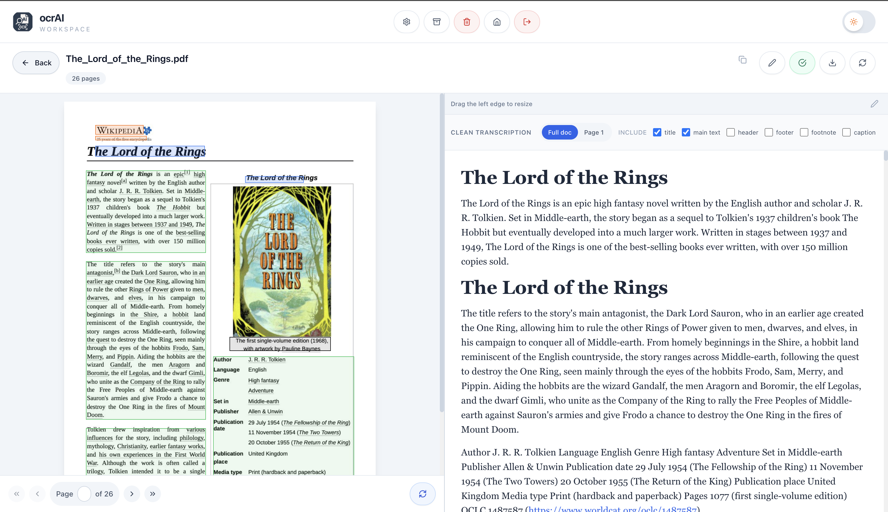
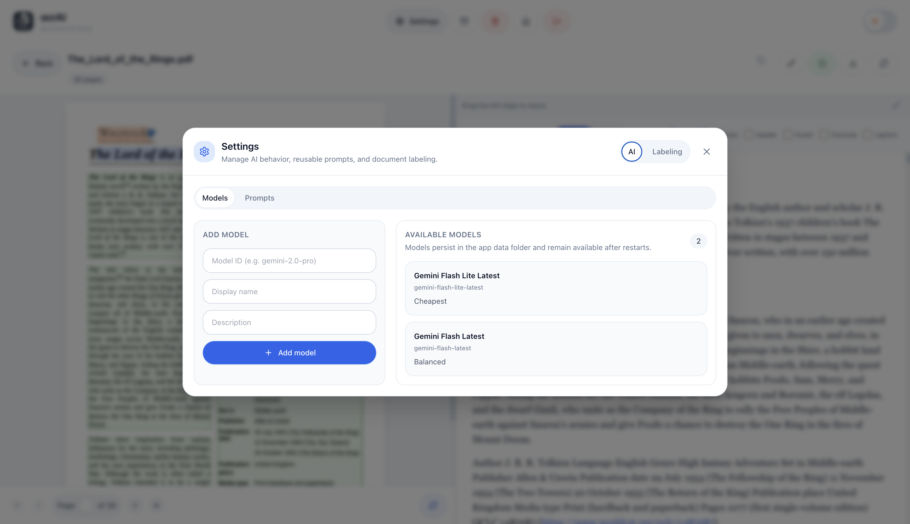

<p align="center">
  
</p>

<h1 align="center">ocrAI Workspace</h1>

<p align="center">
  OCR workspace for scanned PDFs and images.
  Extract text, clean it up, review page by page, organize documents, and export polished output.
</p>

<p align="center">
  
  
  
  
  
  
</p>

<p align="center">
  <strong>Cloud or local OCR.</strong>
  Use Gemini, LM Studio, or Ollama.
  Autodetect installed local models, choose the default provider in settings, and keep working in one review workflow.
</p>

## Overview

ocrAI is built for documents that need more than a raw OCR dump. It combines OCR extraction, cleanup, review, editing, organization, and export in a single workspace.

The app is especially useful for:

- scanned books and articles
- lecture notes and handwritten or mixed-source documents
- research PDFs that need cleanup before reading
- archives that need folder organization, labels, and reprocessing
- users who want local OCR with `LM Studio` or `Ollama` instead of sending files to a cloud provider

## Screenshots

<table>
  <tr>
    <td width="50%">
      
    </td>
    <td width="50%">
      
    </td>
  </tr>
  <tr>
    <td valign="top">
      <strong>Dashboard</strong><br />
      Browse your library, search documents, filter by label, status, date, or folder, and manage read state, renaming, moving, reprocessing, and deletion.
    </td>
    <td valign="top">
      <strong>Reader + Editor</strong><br />
      Review the original page beside the cleaned transcription, reprocess a page or the full document, and export the final result once it is ready.
    </td>
  </tr>
</table>

<p align="center">
  
</p>

<p align="center">
  <strong>Settings</strong><br />
  Manage OCR behavior, reusable prompts, labels, and model configuration.
</p>

## What It Does

### OCR and extraction

- OCR workflows for PDFs and images
- `Gemini`, `LM Studio`, and `Ollama` support
- local model autodetection for `LM Studio` and `Ollama`
- configurable host and port for both local providers
- shared OCR prompt rules for paragraph reconstruction, de-hyphenation, and multi-column reading order
- per-page and full-document reprocessing

### Review and cleanup

- side-by-side page preview and cleaned transcription
- rich text editing
- clean document reconstruction instead of line-by-line OCR noise
- optional full-text search through OCR text and saved edits

### Organization

- folders and nested navigation
- document labels
- read and unread state
- rename, move, and delete actions
- automatic AI labeling for new documents
- filters by label, status, date, and folder

### Export

- TXT
- HTML
- EPUB
- PDF
- ZIP batch export

### Workspace and persistence

- login-protected workspace
- Redis-backed session handling
- filesystem persistence for processed document assets and metadata

## OCR Providers

ocrAI supports three OCR backends:

| Provider | Type | Notes |
| --- | --- | --- |
| `Gemini` | Cloud | Best when you want a managed OCR model and already have a `GEMINI_API_KEY`. |
| `LM Studio` | Local | OpenAI-compatible local endpoint. Configure host and port, autodetect installed models, and choose one as the default OCR model. |
| `Ollama` | Local | Local chat API. Configure host and port, autodetect installed models, and select a vision-capable model for OCR tasks. |

### Local provider setup

1. Open `Settings`.
2. Go to `AI > Models`.
3. Choose the active OCR provider.
4. For `LM Studio` or `Ollama`, enter host and port.
5. Click `Autodetect` to load installed local models.
6. Select the default OCR model for that provider.
7. Save OCR settings.

Default local endpoints:

- `LM Studio`: `127.0.0.1:1234`
- `Ollama`: `127.0.0.1:11434`

## Tech Stack

- `React 18` + `TypeScript`
- `Vite`
- `Express 5`
- `Redis` for session state and login protection
- `@google/genai` for Gemini OCR
- local provider integration for `LM Studio` and `Ollama`
- filesystem storage under `data/`

## Local Development

### Requirements

- `Node.js 20+`
- `Redis`
- a Gemini API key if you want to use the Gemini provider
- optional local OCR runtime: `LM Studio` or `Ollama`

### Environment

Create a `.env.local` file in the project root:

```env
ADMIN_USERNAME=admin
ADMIN_PASSWORD=change-me
REDIS_URL=redis://localhost:6379

# Required only if you want to use Gemini
GEMINI_API_KEY=your-gemini-api-key

# Optional
PORT=5037
CORS_ORIGIN=http://localhost:5173
TRUST_PROXY=false
```

Notes:

- You can use `ADMIN_PASSWORD_HASH` instead of `ADMIN_PASSWORD`.
- If you plan to work only with `LM Studio` or `Ollama`, the Gemini key is optional.

### Start the app

1. Install dependencies:

   ```bash
   npm install
   ```

2. Start Redis:

   ```bash
   docker run -d --name ocrai-redis -p 6379:6379 redis:alpine
   ```

   Or use your local Redis installation.

3. Start the backend API:

   ```bash
   node server.js
   ```

4. In a second terminal, start the frontend:

   ```bash
   npm run dev
   ```

5. Open [http://localhost:5173](http://localhost:5173).

Vite proxies `/api` requests to `http://localhost:5037`.

## Production Build

Build the frontend and run the bundled server:

```bash
npm run build
npm start
```

The production server listens on `5037` by default.

## Docker

### Run with Docker Compose

```bash
docker compose up --build
```

This starts:

- `redis`
- `ocrAI` on `http://127.0.0.1:5039`

### Build and run manually

```bash
docker build -t drakonis96/ocrai:local .
docker run -p 5037:5037 --env-file .env.local -v "$(pwd)/data:/app/data" drakonis96/ocrai:local
```

### Pull the published image

```bash
docker pull drakonis96/ocrai:latest
```

## Testing

Run the test suite:

```bash
npm test
```

Run a production build check:

```bash
npm run build
```

## Data Layout

Runtime data is stored under `data/`.

Typical contents include:

- `data/<docId>/metadata.json`
- page images for each uploaded document
- generated page markdown
- persisted prompt, label, model, and OCR settings JSON files

This makes the workspace easy to inspect and back up.

## Project Structure

```text
components/    React UI
services/      backend services and OCR integrations
utils/         storage and shared helpers
tests/         Vitest test suite
screenshots/   README screenshots
images/        branding assets
data/          runtime document storage
```

## Troubleshooting

- Cannot log in:
  verify `ADMIN_USERNAME` and either `ADMIN_PASSWORD` or `ADMIN_PASSWORD_HASH`.
- Sessions fail or login is unstable:
  verify that Redis is running and that `REDIS_URL` is correct.
- Uploads or OCR requests fail with Gemini:
  verify `GEMINI_API_KEY` and model access.
- Local OCR autodetect fails:
  verify the provider is running and that host and port in `Settings` match the local server.
- Files are processed but the UI cannot load them:
  ensure `data/` exists and is writable by the app.

## License

This repository does not currently declare a license file.
