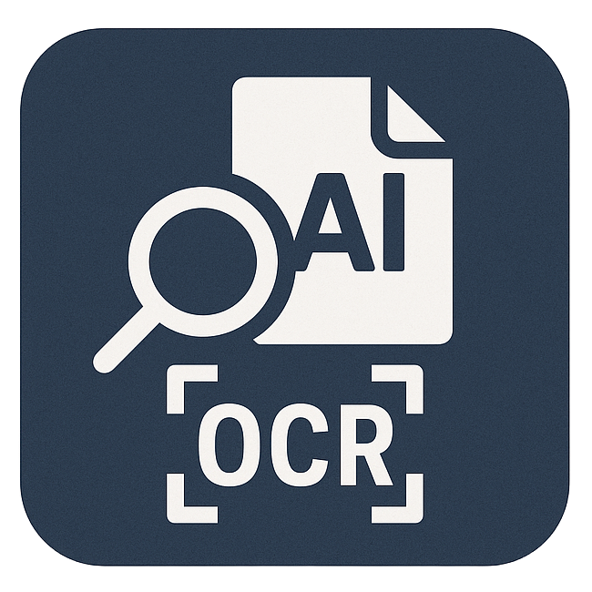

<p align="center">
  
</p>

# ocrAI

ocrAI is a document cleanup and note-taking workspace. Upload PDFs or images, run Gemini-powered OCR, review the extracted content in a built-in editor, organize documents into folders, label them, and export the cleaned output in multiple formats.

## Highlights
- Authentication-protected workspace
- OCR, translation, and manual extraction flows
- Shared OCR prompt rules for paragraph reconstruction, de-hyphenation, and multi-column reading order
- Rich text editor with per-page and full-document reprocessing
- Persistent folders, document renaming, read/unread state, and labels
- Automatic AI-based labeling from document names
- TXT, HTML, EPUB, PDF, and ZIP export flows

## Processing model defaults
- The default processing model is `gemini-flash-lite-latest`.
- If the user explicitly selects the normal Flash model, that selection is respected for processing and reprocessing.

## How it works
1. Upload a PDF or image from the dashboard.
2. The backend stores page images and metadata under `data/<docId>/`.
3. Gemini extracts layout-aware text blocks for each page.
4. ocrAI reconstructs readable document text while preserving true paragraph structure instead of visual line wrapping.
5. You can review, rename, label, move, reprocess, and export the final document.

## Configuration
Create a `.env.local` file in the project root:

```env
GEMINI_API_KEY=your-gemini-api-key-here
ADMIN_USERNAME=your-username
ADMIN_PASSWORD=your-password
```

Keep `.env.local` out of version control.

## Local development
1. Install dependencies:

   ```bash
   npm install
   ```

2. Start the app:

   ```bash
   npm run dev
   ```

3. Open the URL shown by Vite, usually `http://localhost:5173`.

## Production build
Build the frontend and run the bundled server:

```bash
npm run build
npm start
```

The production server listens on port `5037`.

## Docker

### Build locally
```bash
docker build -t drakonis96/ocrai:local .
docker run -p 5037:5037 --env-file .env.local -v "$(pwd)/data:/app/data" drakonis96/ocrai:local
```

### Use Docker Compose
```bash
docker compose up --build
```

### Pull the published image
```bash
docker pull drakonis96/ocrai:latest
```

## Testing
Run the full automated suite:

```bash
npm test
```

Run a production build check:

```bash
npm run build
```

## Troubleshooting
- Cannot log in: verify `ADMIN_USERNAME` and `ADMIN_PASSWORD`.
- Uploads never finish: verify `GEMINI_API_KEY` and Gemini model access.
- Storage issues: ensure `data/` exists and is writable.
- Docker issues: confirm `.env.local` is mounted and port `5037` is available.
